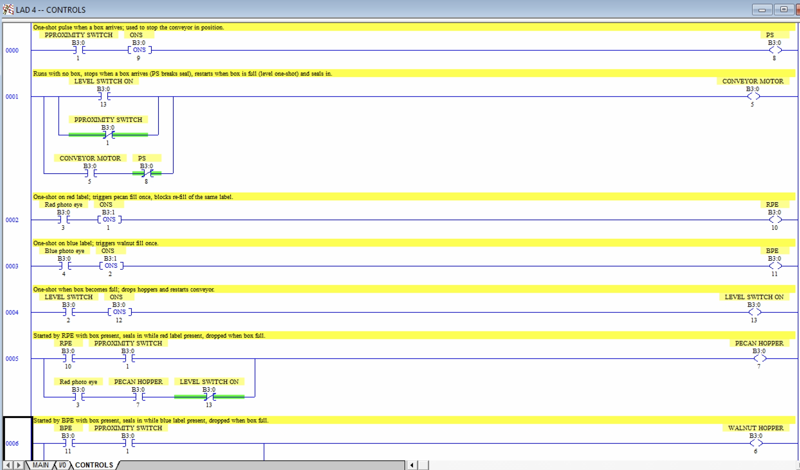
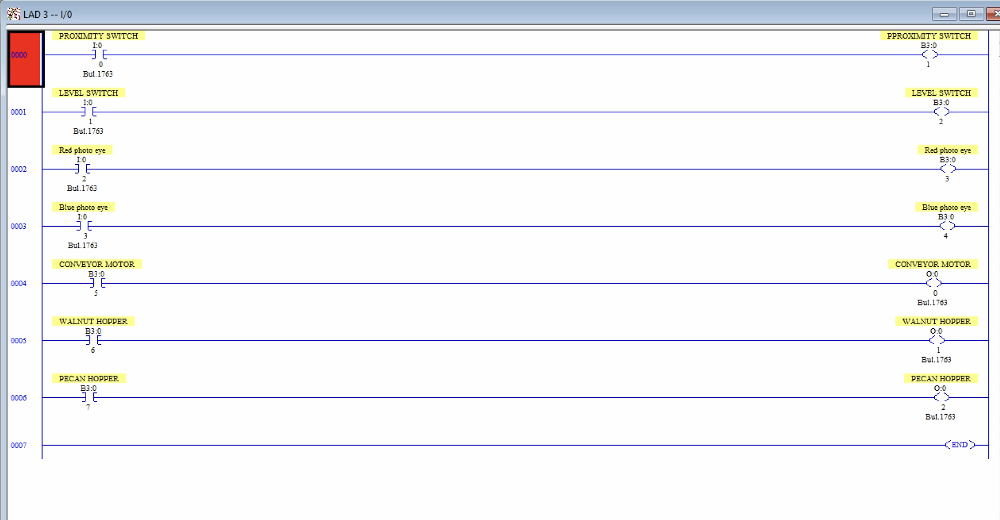

# Project 2 – Nut Filling Station

A conveyor-based filling station built in RSLogix 500 that routes labeled boxes to the correct hopper and manages the full fill cycle automatically.

## Process

A conveyor carries boxes with colored labels to a filling station. A proximity switch detects when a box arrives, and a red or blue photo eye reads the label. Red-labeled boxes are filled with pecans; blue-labeled boxes with walnuts. A level switch signals when the box is full and ready to move on.

## I/O

| Address | Device | Function |
|---------|--------|----------|
| I:0/0 | Proximity switch | Closes when a box is near |
| I:0/1 | Level switch | Closes when the box is full |
| I:0/2 | Red photo eye | Closes on a red label |
| I:0/3 | Blue photo eye | Closes on a blue label |
| O:0/0 | Conveyor motor | Runs the conveyor forward |
| O:0/1 | Walnut hopper | Opens solenoid to release walnuts |
| O:0/2 | Pecan hopper | Opens solenoid to release pecans |

## Approach

The process is handled as a repeating cycle rather than a set of independent reactions:

- The conveyor runs whenever no box is in position. A one-shot off the proximity switch breaks that seal-in the instant a box arrives, stopping the conveyor with the box in place.
- Rising-edge one-shots on each photo eye trigger the correct hopper **once per box**, which prevents the hopper from re-opening and overfilling while the same label sits in front of the eye.
- Each hopper only energizes with the proximity switch still made — a label reading with no box in position can't dump product on the floor. Once triggered, the hopper seals itself in through its photo eye and drops out the moment the box is full.
- A one-shot off the level switch drops both hoppers and re-energizes the conveyor motor, which then seals itself back in — cleanly ending one cycle and letting the next box arrive.

**Assumption:** every box carries a red or blue label. An unlabeled box would stop at the station without filling.

## Files

- [Project2.pdf](docs/Project2.pdf) — original project specification and requirements
- `docs/Project2.RSS` — RSLogix 500 project file (requires RSLogix 500 to open)

## Ladder Logic

**Control Logic**

**I/O Mapping**

