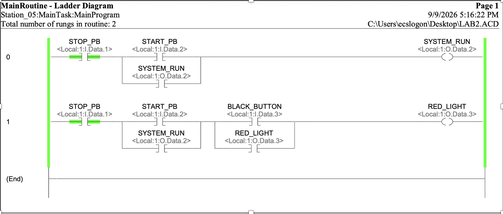
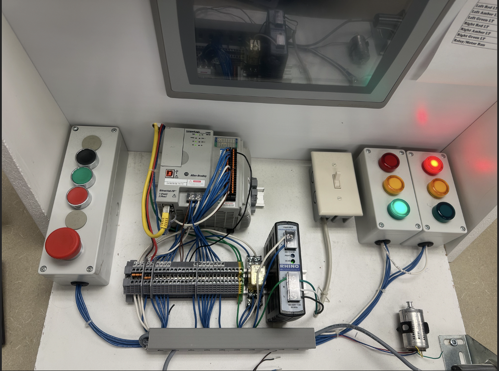

# CompactLogix 3-Wire Start/Stop

## Overview
A tag-based ladder logic program for an Allen-Bradley CompactLogix PLC, written in Studio 5000 and downloaded to a physical lab station with push buttons and pilot lights, connected over EtherNet/IP via RSLinx.

Rung 0 implements a classic 3-wire start/stop circuit with a seal-in branch that drives a System Run output (green light). Rung 1 adds an interlocked red light: a black push button can only latch it while System Run is active, and the Stop button de-energizes both outputs.

I/O mapping:
- Stop PB — `Local:1:I.Data.1`
- Start PB — `Local:1:I.Data.2`
- Black PB — `Local:1:I.Data.3`
- System Run — `Local:1:O.Data.2`
- Red Light — `Local:1:O.Data.3`

The station's Stop button is wired normally open, so it's examined with an XIO instruction. In industrial practice, Stop is wired normally closed and examined with XIC instead, so that a broken wire fails safe (it reads as if Stop were pressed rather than silently disabling the stop function).

Tested on hardware: the seal-in held after releasing Start, the red light only latched once System Run was active, and Stop cleared both outputs. Troubleshooting during bring-up covered the PLC being left in Program mode and a missing Ethernet link that blocked going online.

## Tech / Tools
Studio 5000, CompactLogix, RSLinx, ladder logic

## Screenshots

*Ladder logic program in Studio 5000*

*Physical lab station — CompactLogix PLC with push buttons and pilot lights*

## Status
Complete
