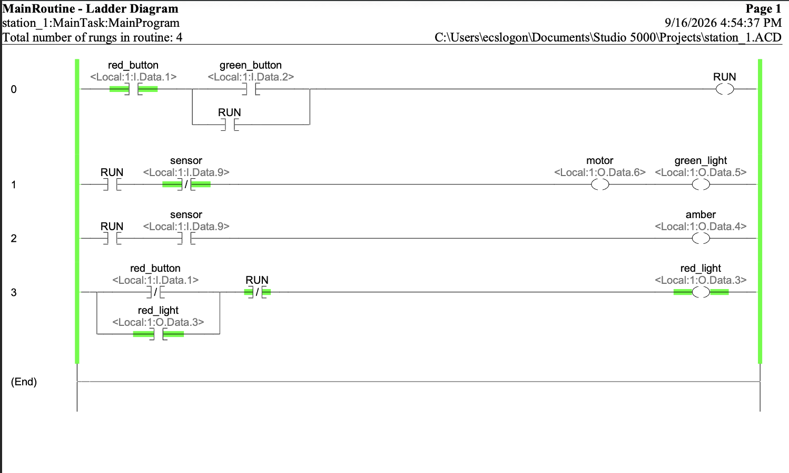
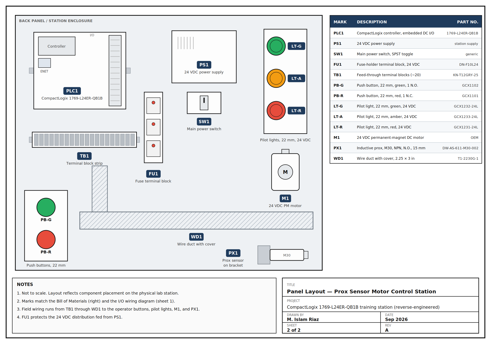
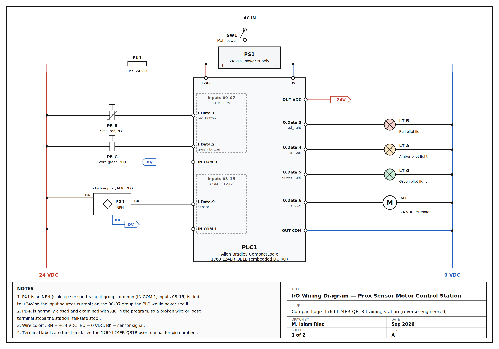

# Prox Sensor Motor Control Station

## Overview
Reverse-engineered a PLC training station built on an Allen-Bradley CompactLogix 1769-L24ER-QB1B. Integrated a 3-wire NPN inductive proximity sensor, programmed the control logic in Studio 5000, and documented the station with a Bill of Materials, panel layout, and wiring diagram so it could be rebuilt.

**Sensor wiring:** brown to +24 VDC, blue to 0 VDC, black signal to `Local:1:I.Data.9`. Because an NPN sensor sinks its output to 0V, it's landed in the 08–15 input group, whose common is tied to +24V — on the wrong group the sensor LED lights but the PLC never sees it.

**I/O:**
- `red_button` (N.C.) — `Local:1:I.Data.1`
- `green_button` (N.O.) — `Local:1:I.Data.2`
- `sensor` — `Local:1:I.Data.9`
- `motor` — `Local:1:O.Data.6`
- `green_light` — `Local:1:O.Data.5`
- `amber` — `Local:1:O.Data.4`
- `red_light` — `Local:1:O.Data.3`
- internal `RUN` bit

**Logic:**
- Rung 0 latches `RUN` from the green button, with the N.C. red stop button examined with XIC (fail-safe: a broken wire stops the station).
- Rung 1 runs the 24 VDC motor and green light while `RUN` is on and the sensor is clear.
- Rung 2 turns on the amber light while `RUN` is on and metal is detected.
- Rung 3 latches the red light when Stop is pressed and clears it when the station restarts.

**Design fix:** the first version had the sensor in series with the `RUN` seal-in, so a detection dropped the latch and the motor never restarted. Moving the latch to its own rung lets the station resume when the target clears.

**Tested on hardware:** motor/green seal in, the sensor swaps motor/green for amber and back, Stop kills all outputs and latches red, and the sensor is ignored until the station is restarted.

## Bill of Materials

| Item | Qty | Mark | Description | Part No. |
|------|-----|------|--------------|----------|
| 1 | 1 | PLC1 | CompactLogix controller, embedded DC I/O | 1769-L24ER-QB1B |
| 2 | 1 | PS1 | 24 VDC power supply | (station supply) |
| 3 | 1 | FU1 | Fuse-holder terminal block, 24 VDC, blown-fuse LED | DN-F10L24 |
| 4 | ~20 | TB1 | Feed-through terminal blocks, 35 mm DIN | KN-T12GRY-25 |
| 5 | 1 | PB-G | Push button, 22 mm, green, 1 N.O. | GCX1102 |
| 6 | 1 | PB-R | Push button, 22 mm, red, 1 N.C. | GCX1101 |
| 7 | 1 | PX1 | Inductive prox sensor, M30, NPN, N.O., 3-wire, 15 mm | DW-AS-611-M30-002 |
| 8 | 1 | M1 | 24 VDC permanent-magnet DC motor | OEM |
| 9 | 1 | LT-G | Pilot light, 22 mm, green, 24 VDC LED | GCX1232-24L |
| 10 | 1 | LT-A | Pilot light, 22 mm, amber, 24 VDC LED | GCX1233-24L |
| 11 | 1 | LT-R | Pilot light, 22 mm, red, 24 VDC LED | GCX1231-24L |
| 12 | as req'd | WD1 | Wire duct with cover, 2.25" x 3" | T1-2230G-1 |
| 13 | 1 | SW1 | Main power switch, SPST toggle | generic |

## Tech / Tools
Studio 5000, CompactLogix, RSLinx, ladder logic, NPN proximity sensor, panel documentation

## Screenshots

*Ladder logic program in Studio 5000*

*Panel layout*

*Wiring diagram*

## Status
Complete
